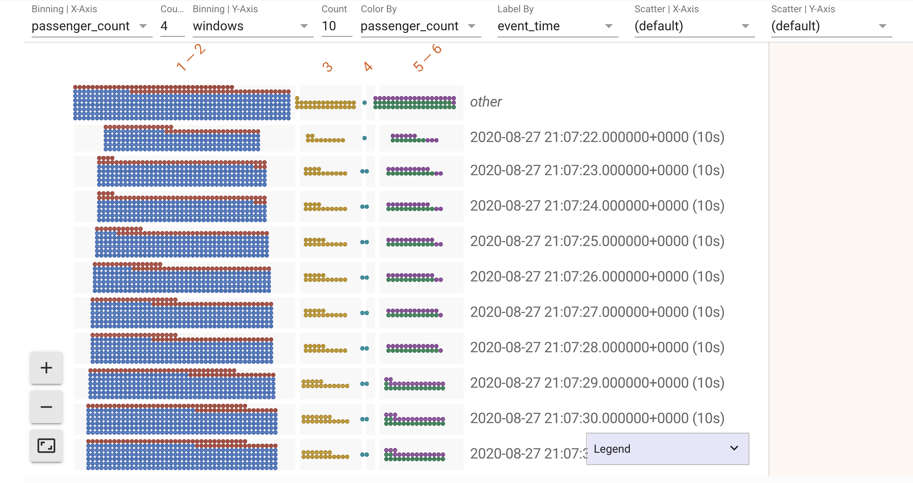

<!--
Licensed to the Apache Software Foundation (ASF) under one
or more contributor license agreements.  See the NOTICE file
distributed with this work for additional information
regarding copyright ownership.  The ASF licenses this file
to you under the Apache License, Version 2.0 (the
"License"); you may not use this file except in compliance
with the License.  You may obtain a copy of the License at

  http://www.apache.org/licenses/LICENSE-2.0

Unless required by applicable law or agreed to in writing,
software distributed under the License is distributed on an
"AS IS" BASIS, WITHOUT WARRANTIES OR CONDITIONS OF ANY
KIND, either express or implied.  See the License for the
specific language governing permissions and limitations
under the License.
-->

# Frequently Asked Questions

1.  [Why can't I see some of the outputs saved in the notebook on Github,
    nbviewer or in JupyterLab?](#q1)
2.  [How do I install dependencies? I've installed my favorite Python library
    but the notebook still says `ModuleNotFoundError`.](#q2)
3.  [How do I read the visualization?](#q3)
4.  [Why is the dataframe returned from `collect` not in the schema that I
    expected?](#q4)
5.  [Why does `ib.collect` or `ib.show` take forever to finish execution? How do
    I stop it?](#q5)
6.  [How do I use local dev Beam Python SDK to run Dataflow jobs from the
    notebook?](#q6)

## <a name="q1"></a>1. Why can't I see some of the outputs saved in the notebook on `Github`, `nbviewer` or even in `JupyterLab`?

Your outputs contain scripts and the `ipynb` file needs to be **trusted** so
that scripts in it can be executed. To view outputs of a shared notebook, the
easiest way is to explicitly trust a notebook: execute `jupyter trust
path/to/ipynb/file` from the command line and re-open the notebook in
`JupyterLab`.

`Github` preview and `nbviewer` will not execute any script in the saved
notebook files. `JupyterLab` or `Jupyter Notebook` also do not trust notebooks
copied from other places. The only notebooks they trust are notebooks created or
executed locally with a signed signature in a local jupyter database.

### Other options

-   Share notebooks through [Colab](https://colab.research.google.com/) or
    `ipynb` file in `Google Drive`. The sandbox environment in `Colab` always
    executes scripts since it's more secure.
-   Share the notebook instance/runtime directly. With
    [Dataflow Notebooks](https://cloud.google.com/dataflow/docs/guides/interactive-pipeline-development),
    multiple collaborators can access the same notebook instance at the same
    time.

## <a name="q2"></a>2. How do I install dependencies? I've installed my favorite Python library but the notebook still says `ModuleNotFoundError`.

It's possible that you have installed a Python dependency through `!pip install`
and still see `ModuleNotFoundError` when executing a notebook. That's because
with `!pip install`, the dependency is installed to the environment of the
notebook runtime (`JupyterLab`) instead of the environment of code execution
(the `IPython` kernel).

To install Python dependencies used when executing a notebook, use a cell magic
in the notebook: `%pip install <my_favorite_lib>`. You might need to restart the
kernel after the installation.

To install dependencies used by the JupyterLab, do `!pip install
<some_global_executable>` or `!jupyter labextension install
<my_favorite_labextension>`. You might need to restart JupyterLab for some
installations to take effect.

`%pip install` installs dependencies to the kernel used to execute Python code
in the notebook, while `!pip install` installs dependencies to the environment
that is running the notebook runtime you are interacting with. They may or may
not be the same environment. If a notebook runtime, such as `Colab`, doesn't
support `%pip install`, it usually means that it has a single environment for
the runtime and kernel. In that case, `!pip install` works.

## <a name="q3"></a>3. How do I read the visualization?

When you do `show(pcolls)`, it displays a paginated searchable and orderable
datatable. By clicking the header of each column, you can order data rows in the
table by that column.

If the PCollection being visualized is from a streaming source recorded in real
time, you will also see dynamic updates in the table. Your ordering, page and
search states will be preserved during those updates.

Additionally, when `include_window_info=True` is provided,
[windowing](https://beam.apache.org/documentation/programming-guide/#windowing)
info of the data will be displayed as additional columns.

When `visualize_data=True` is provided, a
[Facets](https://pair-code.github.io/facets/) visualization of the data will be
displayed. It's a useful generalized visualization for arbitrary data set. You
can quickly gain insights into the distribution of your data and dive into the
data set with data binning and scatter plotting.

Take below New York taxi ride data (can be found in
[03-Streaming_NYC_Taxi_Ride_Data](Examples/03-Streaming_NYC_Taxi_Ride_Data.ipynb)
)for an example:


The first part of the [Facets](https://pair-code.github.io/facets/)
visualization can look like this if colored by `passenger_count`:


The color difference with the legend gives you an idea about the passenger count
distribution per taxi ride in New York. You can additionally bin the data by
`passenger_count` and choose a binning count of 4. This makes the data
categorization by `passenger_count` more obvious:


Additionally, you can bin the data by `windows`. Now you see how the
distribution of `passenger_count` changes in New York by time window:



If you want to analyze the location of each ride relatively, do a scatter plot
by setting `Scatter | X-Axis` as `latitude` and `Scatter | Y-Axis` as
`longitude`:


The second part of the [Facets](https://pair-code.github.io/facets/)
visualization can look like this:


Your data fields with digital values are analyzed as `numerical features` while
other fields are analyzed as `categorical features`.

## <a name="q4"></a>4. Why is the dataframe returned from `collect` not in the schema that I expected?

This is because `Interactive Beam` doesn't understand your data. It converts
your data from materialized PCollection into a `pandas Dataframe` object so that
it can be visualized or collected for further usage outside of a `Beam` pipeline
execution. The conversion doesn't require your intervention and auto generates
column names if absent for the columns/fields in the data.

Columns with deeply nested data or iterables in variable lengths are not
flattened in the collected Dataframe. When visualized, they are simply converted
to strings as categorical data.

To convert the data into your expected schema, you can give `Interactive Beam`
more hints about the structure of your data and surface the data you are
interested in by flattening nested fields.

Formatted data such as JSON objects are good structured sources when they are
neither deeply nested nor variable in length for each data point. For data that
are not columnized but formatted in fixed patterns, such as fixed-length arrays,
`namedtuple` is recommended. An example to convert data read from csv files into
schemed data:

Take data from [covidtracking.com](http://covidtracking.com) as an example. We
can download one of the daily COVID tracking data for the United States. Each
row of the data contains tracking information for a state. When you read from
the csv file:

```python
pcoll = p | 'Read CSV' >> beam.io.ReadFromText(csv_file, skip_header_lines=1)
```

Each row is in a comma separated format with fixed length in columns:


You can then create a `namedtuple` using the headers of the csv file:

```python
from collections import namedtuple
from csv import reader

def read_headers(csv_file):
  with open(csv_file, 'r') as f:
    header_line = f.readline().strip()
  return next(reader([header_line]))

headers = read_headers(csv_file)
UsCovidData = namedtuple('UsCovidData', headers)

class UsCovidDataCsvReader(beam.DoFn):
  def __init__(self, schema):
    self._schema = schema

  def process(self, element):
    values = [int(val) if val.isdigit() else val for val in next(reader([element]))]
    return [self._schema(*values)]

pcoll_with_schema = pcoll | 'Parse' >> beam.ParDo(UsCovidDataCsvReader(UsCovidData))
```

Then each row is structured:


## <a name="q5"></a>5. Why does `ib.collect` or `ib.show` take forever to finish execution? How do I stop it?

For a streaming pipeline, to enable a deterministic replay throughout the
notebook execution, an implicit background source recording job records a
bounded segment of source data from unbounded sources that are of any class
specified by `ib.options.recordable_sources`. The recording only stops when
either `ib.options.recording_duration` or `ib.options.recording_size_limit` is
met. Additionally, there are 2 optional parameters for `ib.collect` and
`ib.show`:

*   `n` - specifies at most how many elements to return
*   `duration` - specifies how long from the beginning of the recording to be
    used

By default, both of these parameters have a special value `inf` that configures
the APIs' behavior as tailing for data. If they are not specified with a
positive finite value, the `ib.collect` and `ib.show` will continue tailing
until the background source recording is completed.

To stop `ib.collect` or `ib.show` earlier, you can interrupt the kernel:

*   You can use the menu item or its shortcut `I, I` to interrupt the kernel:
    
*   You can also use the button in toolbar to interrupt the kernel:
    

## <a name="q6"></a>6. How do I use local dev Beam Python SDK to run Dataflow jobs from the notebook?

If you custom built the Beam Python SDK locally in the notebook instance, you
need to set the `sdk_location` option for the Dataflow Runner. **This is
unnecessary if you are using an officially released version of Apache Beam.**

First, generate a tar ball of the sdk:

```bash
   source ${LOCAL_DEV_BEAM_VENV}/bin/activate
   cd ${LOCAL_DEV_BEAM_SRC}/sdks/python
   python setup.py sdist
```

Then configure your pipeline options in the notebook:

```python
  options.view_as(pipeline_options.SetupOptions).sdk_location = (
      '${LOCAL_DEV_BEAM_SRC}/sdks/python/dist/apache-beam-${x.x.x}.dev0.tar.gz')
```
